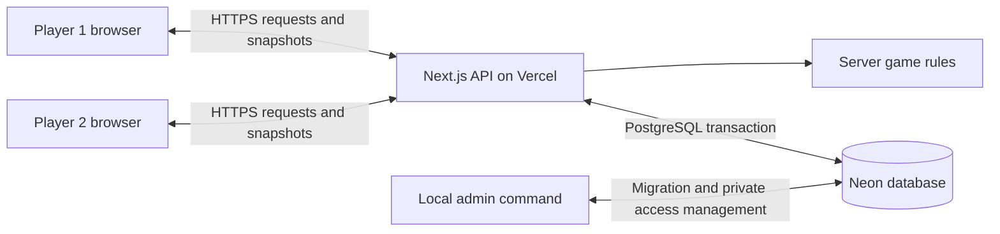
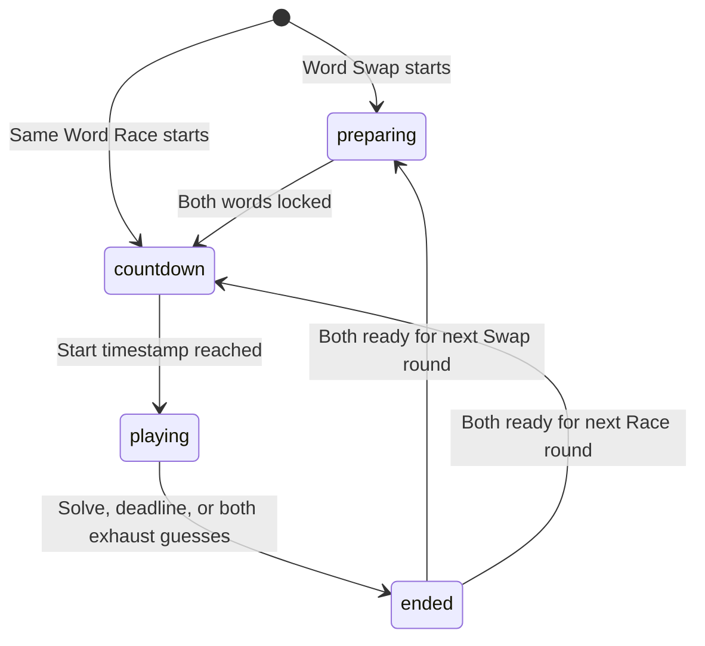

# WordWorld: implementation and operation report

Prepared 11 September 2026 from the current source code. This report describes the implemented application, rather than proposed features. Code links point to this local checkout. No database credentials or invitation tokens are included.

## 1. What the application provides

WordWorld is a private word game for two fixed player identities sharing one persistent room. It supports Same Word Race, Word Swap, single-round matches, and a series in which the first player to win three rounds wins the match. Both players can return to their room, view past matches and statistics, and change room and profile settings between matches.

The room has no programmed expiration. Its continued availability depends on keeping the deployment and database available. Invitation expiration and browser-session expiration are separate from room persistence.

The implementation assumes player IDs `1` and `2` throughout. Multiple independent rooms and more than two participants are not implemented. The database even restricts its state table to the single row with ID `1`.

References: [game types](C:/Users/Dell/OneDrive/Desktop/WordWorld/server/types.ts:1), [initial room creation](C:/Users/Dell/OneDrive/Desktop/WordWorld/server/state-store.ts:105), [database schema](C:/Users/Dell/OneDrive/Desktop/WordWorld/migrations/001-postgres.sql:4).

## 2. Architecture and responsibilities



| Component | Responsibility | Code |
|---|---|---|
| React interface | Access forms, lobby, board, keyboard, results, history and settings | [app/page.tsx](C:/Users/Dell/OneDrive/Desktop/WordWorld/app/page.tsx:84) |
| Visual presentation | Responsive layout, colors, board styling and feedback | [app/globals.css](C:/Users/Dell/OneDrive/Desktop/WordWorld/app/globals.css) |
| Browser request client | Polling, immediate actions, reconnect handling and snapshot ordering | [client/live.ts](C:/Users/Dell/OneDrive/Desktop/WordWorld/client/live.ts:4) |
| Next.js route | Runs the API handler in the Node.js runtime | [route.ts](C:/Users/Dell/OneDrive/Desktop/WordWorld/app/api/[...path]/route.ts) |
| HTTP handler | Origin checks, authentication, validation, limits and responses | [server/http.ts](C:/Users/Dell/OneDrive/Desktop/WordWorld/server/http.ts:13) |
| Game engine | Determines legal actions, scoring and outcomes | [server/game.ts](C:/Users/Dell/OneDrive/Desktop/WordWorld/server/game.ts:20) |
| Durable presence | Reconstructs matches and settles elapsed timers | [server/live.ts](C:/Users/Dell/OneDrive/Desktop/WordWorld/server/live.ts:4) |
| Database adapter | Connections, migration and atomic state transactions | [server/database.ts](C:/Users/Dell/OneDrive/Desktop/WordWorld/server/database.ts:15) |
| State store | Profiles, access tokens, sessions, history and live state | [server/state-store.ts](C:/Users/Dell/OneDrive/Desktop/WordWorld/server/state-store.ts:59) |
| Administration | Setup, replacement access, revocation, backup and import | [server/admin.ts](C:/Users/Dell/OneDrive/Desktop/WordWorld/server/admin.ts) |

Vercel hosts the frontend and request handlers. Neon stores durable data. The browser never connects directly to Neon. The local admin tool connects to the same database independently of the website.

The current multiplayer transport uses ordinary HTTP requests. There is no persistent Socket.IO service in the production architecture. Names such as `socket`, `emit`, and `io server disconnect` remain in the client interface for compatibility with the earlier implementation; they do not mean WebSockets are being used.

## 3. Setup and private access

Running `npm run admin -- setup` first applies the PostgreSQL migration. It then creates a random setup token and prints a URL containing `#access=...`. Generating this link does not itself create the two player profiles; accepting the setup form does that.

When opened, the page reads the token from the URL fragment, removes it from the address bar, and sends it to `/api/inspect`. A valid setup token displays the form for the two names and room name. Submitting the form calls `/api/accept`.

`StateStore.accept()` creates the room and both profiles, consumes the setup token, creates player 1's session, and generates a separate invitation for player 2. The HTTP handler sends the session as a cookie and returns the partner invitation to the interface. Player 2 opens that invitation and receives their own session after acceptance.

References: [admin setup](C:/Users/Dell/OneDrive/Desktop/WordWorld/server/admin.ts:1), [fragment handling](C:/Users/Dell/OneDrive/Desktop/WordWorld/app/page.tsx:124), [accept form submission](C:/Users/Dell/OneDrive/Desktop/WordWorld/app/page.tsx:340), [token and session creation](C:/Users/Dell/OneDrive/Desktop/WordWorld/server/state-store.ts:85).

| Item | Lifetime and behavior |
|---|---|
| Setup link | Valid for 24 hours by default; consumed on successful acceptance. A new setup command replaces outstanding setup links and refuses to run after room setup. |
| Player invitation | Valid for 24 hours by default; consumed on successful acceptance. |
| Browser session | Expires 90 days after creation. It is not automatically extended by normal polling. |
| Room and history | No application expiry; stored in PostgreSQL. |

Tokens and sessions use 32 random bytes, encoded as URL-safe text. The database stores their SHA-256 hashes rather than their original values. The cookie is `HttpOnly`, `SameSite=Strict`, and `Secure` in production. Browser JavaScript cannot read an HttpOnly cookie, but the browser sends it with same-origin requests.

A bookmark to the regular website works while that browser has a valid session. A different browser, cleared cookies, or an expired session requires a new player invitation. The same identity can have multiple sessions; two identities does not mean only two physical devices can ever connect.

References: [session lifetime](C:/Users/Dell/OneDrive/Desktop/WordWorld/server/state-store.ts:105), [cookie and authentication handling](C:/Users/Dell/OneDrive/Desktop/WordWorld/server/http.ts:67).

## 4. What happens when a player submits a guess

1. The interface sends an action containing the guess, current round ID and unique request ID.
2. The API validates the request origin, payload and session. The authenticated cookie determines the player identity.
3. A database transaction locks the shared state row and reads the database clock.
4. The server reconstructs the game and settles any elapsed countdown, deadline or disconnection boundary.
5. The game engine checks the round ID, request ID, phase, remaining attempts and dictionary membership.
6. An accepted guess receives server-calculated letter marks. A correct answer ends the round immediately; the engine updates the result and any series score.
7. The updated state and revision are committed. The submitting player receives a filtered snapshot.
8. The partner sees the result through their next poll.

The unique request ID prevents a repeated submission with the same ID from consuming another attempt. A stale round ID is rejected. If two winning requests compete, the transaction processed first determines the result; browser timestamps do not decide the winner. Network latency can therefore affect a close race.

References: [action validation](C:/Users/Dell/OneDrive/Desktop/WordWorld/server/game.ts:156), [transaction and database clock](C:/Users/Dell/OneDrive/Desktop/WordWorld/server/database.ts:59), [browser action requests](C:/Users/Dell/OneDrive/Desktop/WordWorld/client/live.ts:78).

## 5. Game rules and scoring

Same Word Race selects a server-side random answer from a curated list and assigns it to both players. Word Swap asks each player to lock a dictionary word for the other player. Once both words are locked, the countdown begins.

The countdown is three seconds, followed by a three-minute round. Each player gets up to six valid guesses. Invalid dictionary words do not consume a guess. The first accepted correct guess wins. If both players exhaust six attempts, or the deadline passes without a solve, the round is a draw. One player's exhaustion alone does not end the other player's opportunity to solve.

A single-round match ends with that round. A series ends when a player reaches three round wins. Draws award no point, so a series can contain more than five rounds. Both players must ready up to start the next round. Rematches also require agreement from both players. Conceding awards the whole match to the partner.

References: [round creation and timing](C:/Users/Dell/OneDrive/Desktop/WordWorld/server/game.ts:63), [round and match completion](C:/Users/Dell/OneDrive/Desktop/WordWorld/server/game.ts:97), [ready, lock, guess and rematch actions](C:/Users/Dell/OneDrive/Desktop/WordWorld/server/game.ts:156).

Letter scoring uses two passes. First, exact-position matches become `correct`. Second, other letters become `present` only if an unmatched copy remains in the answer; the rest stay `absent`. This prevents duplicate letters in a guess from receiving more credit than the answer allows. For example, guessing `ALLEY` against `APPLE` produces `correct, present, absent, present, absent`.

Reference: [score()](C:/Users/Dell/OneDrive/Desktop/WordWorld/server/types.ts:51).

## 6. Synchronization, refreshes and disconnections

`LiveClient.poll()` schedules another state request one second after the preceding request finishes. This means the actual interval includes response latency. Actions are sent immediately rather than waiting for a poll. Each snapshot includes a revision; the browser ignores responses older than the newest revision it has already displayed.

Every browser tab has an identifier. A heartbeat marks that tab present for five seconds. Presence is aggregated across valid tabs, so closing one tab does not disconnect a player whose other tab remains active. A page-hide request attempts to mark the departing tab absent immediately; if that request is lost, heartbeat expiry handles it.

After presence expires, the player has a 30-second grace period. If one player remains online at the evaluated expiry boundary, the disconnected player forfeits the match. If both are offline at that boundary, the match is abandoned without a winner. With a lost connection and no leave request, detection plus grace is approximately 35 seconds after the last heartbeat.

No permanent background timer is required. Each authenticated gameplay request rebuilds the game and processes elapsed boundaries chronologically before making a returning player online. A Vercel process restart therefore does not erase the match. If nobody sends a request, an elapsed outcome is recorded when a later request settles it. At a tied evaluation time, round deadline handling precedes disconnect handling.

References: [polling and revisions](C:/Users/Dell/OneDrive/Desktop/WordWorld/client/live.ts:28), [presence reconstruction and heartbeat](C:/Users/Dell/OneDrive/Desktop/WordWorld/server/live.ts:4), [deadline and forfeit rules](C:/Users/Dell/OneDrive/Desktop/WordWorld/server/game.ts:132).

## 7. Storage and concurrency

The `wordworld_state` table contains one JSONB document, a revision number and an update timestamp. The document contains profiles, room settings, hashed tokens and sessions, matches, live presence/readiness and rate-limit counters.

`transact()` uses `BEGIN`, `SELECT ... FOR UPDATE`, a JSONB update, and `COMMIT`. The row lock serializes competing requests, including those handled by different Vercel instances. Exceptions that escape the callback trigger `ROLLBACK`. Expected action-validation errors are returned as responses inside the transaction, allowing heartbeat, elapsed-time and rate-limit changes to remain saved.

The connection pool allows up to two connections per process. This is not a global two-connection cap across all Vercel instances. Connection and idle timeouts are ten seconds; transactions set an eight-second lock timeout and a ten-second statement timeout.

This arrangement is straightforward for one private room. It rewrites the full state document for transactions, including normal polling. History growth increases work, statistics are recomputed from history, and all requests contend for the same row. It is not an architecture for a public service with many rooms without further changes.

References: [schema](C:/Users/Dell/OneDrive/Desktop/WordWorld/migrations/001-postgres.sql:4), [data shape](C:/Users/Dell/OneDrive/Desktop/WordWorld/server/state-store.ts:20), [connection pool](C:/Users/Dell/OneDrive/Desktop/WordWorld/server/database.ts:32), [transaction](C:/Users/Dell/OneDrive/Desktop/WordWorld/server/database.ts:59).

## 8. Privacy, API and statistics

During an active round, `Game.snapshot()` returns only the requesting player's guess contents, plus both attempt counts. It omits answers and the partner's guesses until the round ends or is abandoned. The server dictionary and answer selection code are not imported into the browser at runtime. Completed history contains revealed boards and answers and requires authentication.

The database does contain the actual answers and guesses; token hashing is not encryption of game history. Someone with database access can read that data.

| Endpoint | Purpose |
|---|---|
| `GET /api/health` | Basic handler availability; does not test the database or origin configuration. |
| `GET /api/session` | Current identity, if authenticated, and whether the room exists. |
| `POST /api/inspect` | Check an invitation without consuming it. |
| `POST /api/accept` | Consume valid access and establish a browser session. |
| `POST /api/state` | Refresh presence and obtain a private snapshot. |
| `POST /api/action` | Validate and execute a game or settings action. |
| `POST /api/leave` | Mark the current tab absent. |
| `GET /api/history?page=1` | Return non-active matches in pages of ten. |

The handler restricts POST bodies to 4 KB and checks their structure. Persistent limits allow 30 access attempts per minute globally, 600 updates per player per minute, 150 actions per player per minute, and five guesses per player per second. Origin checks require non-GET requests to come from the configured site. Response and application headers discourage caching, referrer leakage and framing.

Statistics include completed-match wins, losses, draws, win rate and streaks, along with round solve rate, fastest solve, average solve time and average guesses for solved rounds. Personal-best markers are calculated chronologically. Abandoned matches do not count as completed-match wins or losses; eligible ended rounds are considered separately by the round calculations.

References: [private snapshot](C:/Users/Dell/OneDrive/Desktop/WordWorld/server/game.ts:301), [API implementation](C:/Users/Dell/OneDrive/Desktop/WordWorld/server/http.ts), [statistics](C:/Users/Dell/OneDrive/Desktop/WordWorld/server/records.ts:1), [security headers](C:/Users/Dell/OneDrive/Desktop/WordWorld/next.config.ts:12).

## 9. Configuration and administration

`DATABASE_URL` tells the server and local admin tool how to connect to Neon. It is a secret. `APP_ORIGIN` identifies the public website origin, is used to build invitations, and determines which request origin is allowed. Production requires HTTPS. The code accepts a root trailing slash and normalizes it; paths, query strings and fragments are rejected.

These values must be available separately to the local command and the deployed application. Editing the local `.env` does not update Vercel. Changes to Vercel environment settings must be included in a new deployment. The two environments must point to the same intended production database when generating production invitations.

| Command | Effect |
|---|---|
| `npm run admin -- setup` | Apply migration and issue a setup link for an unconfigured room. |
| `npm run admin -- access 1` | Replace outstanding player 1 invitations; keep existing sessions. |
| `npm run admin -- access 2` | Replace outstanding player 2 invitations; keep existing sessions. |
| `npm run admin -- revoke 2` | Revoke player 2 sessions and invitations, then issue fresh access. |
| `npm run db:migrate` | Apply the database schema without issuing access. |
| `npm run admin -- backup private-backup.json` | Write a consistent application backup to a new file. |
| `npm run admin -- restore private-backup.json` | Restore into an empty target database. |
| `npm run admin -- import-sqlite old.sqlite` | Import profiles and history from the original SQLite version into an empty target. |

Restore/import resets access tokens, sessions and live state, and abandons unfinished matches. Fresh invitations are required afterward. Backups contain private application data. The SQLite implementation remains for migration and regression testing; production persistence uses PostgreSQL.

References: [admin implementation](C:/Users/Dell/OneDrive/Desktop/WordWorld/server/admin.ts), [Vercel configuration](C:/Users/Dell/OneDrive/Desktop/WordWorld/vercel.json), [deployment guide](C:/Users/Dell/OneDrive/Desktop/WordWorld/VERCEL.md), [environment example](C:/Users/Dell/OneDrive/Desktop/WordWorld/.env.example).

## 10. How the code executes: function-by-function walkthrough

### 10.1 React state and page initialization

`Page()` is the main React component. `useState` holds values that affect rendering: `access` selects the login or room screen, `state` holds the latest server snapshot, `draft` holds unsubmitted letters, and `pending` disables repeated input while an action is awaiting a response. Updating these values causes React to render the appropriate interface.

`useRef` retains mutable objects without causing a render. It holds the request client, the pending guess's request ID, and the previous round and phase. `useEffect` connects browser-side work to component lifecycle events.

The initial effect has two branches:

```text
URL has #access token → inspect token → display setup/invitation form
URL has no token      → check session → display room/private-access screen
```

After `access` becomes `room`, another effect creates `LiveClient`. Its `state` listener calls `setState(data)`. If the round ID changes, the listener clears old draft letters, the selected secret and any pending guess ID. The effect's cleanup disconnects the client when it is no longer needed.

Preferences are saved separately in `localStorage` under `ww-preferences`. They control sound, reduced motion and contrast; they are not the authentication mechanism. The sound effect creates a short browser oscillator rather than fetching an audio file.

Code: [Page state and effects](C:/Users/Dell/OneDrive/Desktop/WordWorld/app/page.tsx:84).

### 10.2 Keyboard input and safe retries

`canGuess` combines four requirements: connected, round playing, fewer than six guesses, and no action pending. The `key()` callback appends a letter, removes the last letter for Backspace, or submits for Enter. Enter first requires exactly five letters.

Before sending, it builds this shape:

```typescript
{ word: draft, roundId, requestId: crypto.randomUUID() }
```

The actual code includes a random-byte fallback for browsers without `randomUUID()`. It retains the object in `request.current`. Retrying the same word in the same round reuses its ID until a successful acknowledgment clears it. This covers a request that the server saved even though the browser missed the response.

`act()` sets pending state, sends the action with a 15-second client timeout, and displays transport or validation errors. It invokes its success callback only when no error was returned. The keyboard event listener is attached once and reads the latest callback through a ref, avoiding repeatedly detaching it during state updates. It ignores typing in form fields and modified keyboard shortcuts.

Code: [act and keyboard handling](C:/Users/Dell/OneDrive/Desktop/WordWorld/app/page.tsx:209).

### 10.3 HTTP client and route delegation

`LiveClient.request()` serializes the payload to JSON, adds `tabId`, and uses `fetch()` with same-origin credentials. `await` pauses that async function until the response arrives without blocking the whole browser. A 401 closes the client as unauthorized. Server failures become errors. A response containing `state` passes through `update()`, which checks the revision before notifying the React listener.

`poll()` uses `try/catch/finally`: it requests state, reports failures, and schedules another poll in `finally` unless the client has closed. This is the reconnect mechanism. `emit()` sends an action through the same request method and delivers its result to the UI callback.

The Next.js route is intentionally small:

```typescript
export const runtime = "nodejs";
export const dynamic = "force-dynamic";
export const maxDuration = 30;
export const GET = handleApi;
export const POST = handleApi;
```

Both HTTP methods delegate to `handleApi()`. The dynamic declaration prevents treating these API responses as static output. The duration setting is a function-execution configuration, not the three-minute game timer.

Code: [request client](C:/Users/Dell/OneDrive/Desktop/WordWorld/client/live.ts:33), [Next.js route](C:/Users/Dell/OneDrive/Desktop/WordWorld/app/api/[...path]/route.ts:1).

### 10.4 Request validation and identity

`handleApi()` parses the URL to select an endpoint. It validates `APP_ORIGIN`, checks the incoming Origin header for non-GET requests, reads bounded JSON, and extracts `ww_session` from the Cookie header. Inside a transaction, `store.session(session)` hashes the cookie value and looks up its unexpired record.

That lookup supplies the `id` passed to `game.action(id, ...)`. The server does not trust a player number sent in an action payload. Endpoints for inspection and acceptance are available before authentication, while state, gameplay and history require a valid identity.

`reply()` constructs JSON responses with status codes and common headers. Expected invalid actions receive an error and an up-to-date snapshot. An exception escaping database processing becomes a generic 503 response, preventing connection details from being exposed to the browser.

Code: [handleApi](C:/Users/Dell/OneDrive/Desktop/WordWorld/server/http.ts:13).

### 10.5 How the database transaction protects a move

The essential SQL sequence in `transact()` is:

```sql
BEGIN;
SELECT data, revision FROM wordworld_state WHERE id=1 FOR UPDATE;
-- Run the application callback against the loaded state.
UPDATE wordworld_state
SET data=$1::jsonb, revision=revision+1, updated_at=clock_timestamp()
WHERE id=1;
COMMIT;
```

This excerpt simplifies the actual code by omitting timeout configuration and the separate database-clock query. `$1` is a query parameter supplied through the driver, rather than interpolated JSON text.

`new StateStore(rows[0].data, databaseTime)` wraps the loaded document. The callback modifies that wrapper through ordinary synchronous methods. `saveMatch()` makes a `structuredClone()` so later mutation of the Game object's match does not silently mutate the saved copy. Once the callback completes, the entire document is written back and committed. `finally` releases the connection whether processing succeeds or fails.

While one transaction holds the lock, another request waits. It subsequently sees the committed outcome and cannot independently award a second winner for a completed round.

Code: [transact](C:/Users/Dell/OneDrive/Desktop/WordWorld/server/database.ts:59), [saveMatch](C:/Users/Dell/OneDrive/Desktop/WordWorld/server/state-store.ts:162).

### 10.6 The game engine as a state machine

The `Game` class stores the current match and temporary coordination state such as readiness. `round` is a getter for the last entry of `match.rounds`. Its constructor accepts a store, a clock and an answer picker. The optional clock and picker make timing and answer choices controllable in tests.



This diagram shows normal round progression. `finishMatch()` can separately end or abandon an active match through concession or disconnection, including during preparation. A completed single round or a third series win ends the match, so it does not proceed to another round through readiness.

`action()` first calls `tick()` to settle time, then branches on the action name. Each branch verifies its permitted phase before changing state. `lock` writes the selected word under the partner's ID. `guess` appends a scored guess and calls `finishRound()` when appropriate. `settings` and `profile` refuse changes during an active match. `swapColors` records one player's request, and swaps only when the partner agrees.

`finishRound()` increments the winner's series score and checks whether the match is complete. `finishMatch()` handles whole-match termination directly; it does not fabricate extra round victories to bring a forfeited series score to three.

Code: [Game constructor and round getter](C:/Users/Dell/OneDrive/Desktop/WordWorld/server/game.ts:20), [action dispatcher](C:/Users/Dell/OneDrive/Desktop/WordWorld/server/game.ts:156).

### 10.7 Walking through repeated-letter scoring

`score()` starts with five `absent` marks and an empty count map called `remaining`. Its first loop marks exact matches and counts only the unmatched answer letters. Its second loop consumes those counts for non-exact guesses.

For answer `APPLE` and guess `ALLEY`, the first `A` is exact. The remaining answer counts become `{P: 2, L: 1, E: 1}`. The first guessed `L` consumes the single available `L`; the next `L` therefore stays absent. The guessed `E` consumes the available `E`; `Y` has no count. The returned array drives tile feedback in the board component.

The rule is implemented by this condition:

```typescript
if (marks[i] !== "correct" && remaining[guess[i]] > 0) {
  marks[i] = "present";
  remaining[guess[i]]--;
}
```

Code: [score](C:/Users/Dell/OneDrive/Desktop/WordWorld/server/types.ts:51), [Board rendering](C:/Users/Dell/OneDrive/Desktop/WordWorld/app/page.tsx:39).

### 10.8 Rebuilding live state after a pause

`resumeGame()` creates a fresh `Game`, clones the persisted match and restores ready/rematch/color-request fields. Its inner `presence(time)` calculates how many valid tabs each player had at a particular timestamp.

It collects the round start, deadline, grace-expiry timestamps and current time, removes boundaries already processed or still in the future, and sorts the remainder. For each boundary it sets `game.now` to that time and calls `game.tick()`. Only after those evaluations does `heartbeat()` register the returning tab as online.

This ordering matters: a player returning after the grace period cannot erase the earlier disconnection outcome by sending a fresh heartbeat first. `saveLive()` then persists the current match, coordination fields and `updatedAt` boundary for the next request.

Code: [resumeGame](C:/Users/Dell/OneDrive/Desktop/WordWorld/server/live.ts:4), [heartbeat](C:/Users/Dell/OneDrive/Desktop/WordWorld/server/live.ts:52), [saveLive](C:/Users/Dell/OneDrive/Desktop/WordWorld/server/live.ts:84).

### 10.9 Producing a safe view for each player

`snapshot(id)` computes whether the round is over, then constructs a response object. Object spread syntax such as `...m` copies fields, while subsequent properties override fields that must be filtered. Setting `rounds: undefined` removes the full rounds array from JSON serialization. Active answers are also `undefined`, and active guesses are replaced with an object containing only the requesting player's entries.

The browser therefore receives a presentation view rather than the database document. This separation is what prevents inspecting the ordinary state response from revealing an active opponent board or target answer. At round completion, the same method includes both answer and guess maps for the result view.

Code: [snapshot](C:/Users/Dell/OneDrive/Desktop/WordWorld/server/game.ts:301).

### 10.10 Statistics and administrative execution

`Records` is an abstract class: it requires a concrete `history()` method and implements calculations on the returned matches. `StateStore` supplies PostgreSQL-document history, while the older SQLite store can reuse the same calculations. `filter()` selects eligible matches/rounds, `flatMap()` combines rounds or successful solves, and `reduce()` totals values for averages. Reversing chronological history allows streaks and personal-best progression to be calculated from oldest to newest.

The admin program reads `process.argv.slice(2)` to choose a command, loads environment variables through `dotenv/config`, and calls `migrate()` before executing that command. Setup and access changes use the same transaction helper as gameplay. Its final `finally` block closes the database pool so the command can exit. This is why the local terminal needs database configuration even though the website is deployed elsewhere.

Code: [Records](C:/Users/Dell/OneDrive/Desktop/WordWorld/server/records.ts:1), [admin entry point](C:/Users/Dell/OneDrive/Desktop/WordWorld/server/admin.ts:1).

## 11. Verification and known operational limits

The existing verification record reports 28 passing unit/integration tests, a passing two-browser end-to-end scenario, successful type checking and a production build. Tests cover game rules, durable access, recovery, timing, multiple tabs, transactions and admin operations. PostgreSQL tests use PGlite with the actual SQL, so they do not establish every hosted-network or concurrent TCP behavior.

References: [recorded verification](C:/Users/Dell/OneDrive/Desktop/WordWorld/VERIFICATION.md), [game tests](C:/Users/Dell/OneDrive/Desktop/WordWorld/tests/game.test.ts), [durability tests](C:/Users/Dell/OneDrive/Desktop/WordWorld/tests/vercel.test.ts), [admin tests](C:/Users/Dell/OneDrive/Desktop/WordWorld/tests/admin.test.ts), [browser scenario](C:/Users/Dell/OneDrive/Desktop/WordWorld/tests/browser/multiplayer.spec.ts).

Those are previously recorded results; tests were not rerun just to produce this report. The verification document predates the user's successful hosted setup command. That later command confirms that the local admin tool reached the configured database and generated a setup token. It does not by itself establish that both players completed a game on the deployed website.

The deployment previously returned an `APP_ORIGIN` configuration error, and a local database connection previously timed out before a later setup attempt succeeded. These are separate failure points: website configuration and local database reachability. A healthy static page or `/api/health` response alone does not prove authenticated gameplay works.

Other practical limits are polling latency and request usage while tabs stay open, browser-session expiry, a single supported room, and increasing transaction cost as history grows. A final operational check should use two independent authenticated browsers to complete a match, refresh, and confirm the saved history on the actual production deployment.
